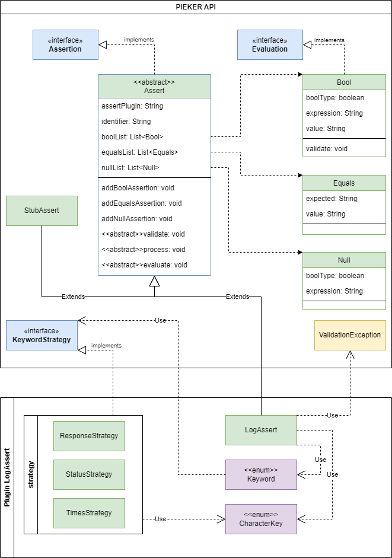

# PIEKER Plugin API

This module contains classes to extend PIEKERs evaluation possibilities. By extending the key-class developers are
allowed to create applicant-specific quality gates.

# Getting Started

1. Create a Java Project
2. Add this module as a dependency library
3. Implement a class extending the abstract class 'Assert'
4. (optional) implement a keyword-strategy to process plugin-expected input easier
5. Create a jar of the project
6. Copy jar to defined plugin directory. (The configuration can be seen/updated [here](../gradle.properties))
7. Run PIEKER (If the plugin is successfully installed, the assert-identifier is Log in the PIEKER configuration.)

You can reference the plugin in a feature file as follows:
```Gherkin
Feature: Foo Config

  Scenario: Foo Scenario

    Step: Foo Step
    
      Then:
        Assert: <assert-identifier>
        Arguments: <arguments>
        Bool: (True/False) | expression
          plugin-expected input
        (Expect/Null): (True/False)
          plugin-expected input
```

# Example

The following image displays a class-diagram of the API implementation and an example of implementing a plugin. 
The example plugin is located [here](../plugins/logs).


