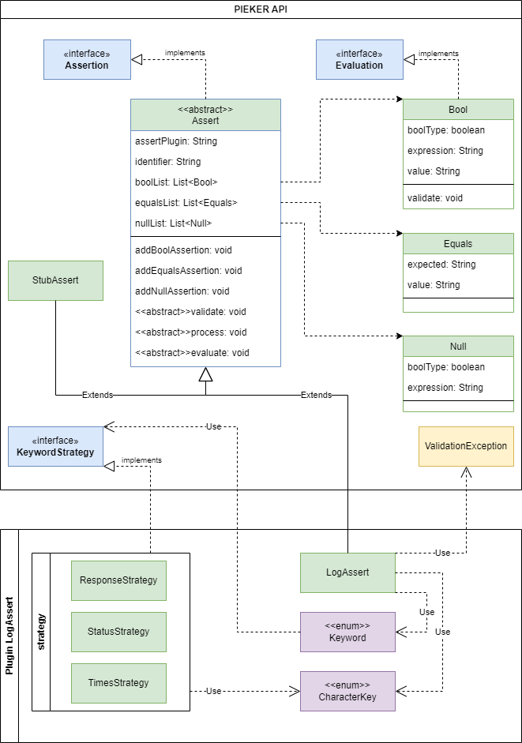

# PIEKER Log Plugin

This file contains details about the Log evaluation implemented for PIEKER.

# Overview



This example displays the way of integrating a plugin to PIEKER. By extending the
abstract class 'Assert', new evaluation processes can be added. Further, the DSL can
be partly individualized. According to the current phase, methods such as 
'validate', 'process' and 'evaluate' are called. Therefore, developers can interfere with 
data specified in the PIEKER DSL. Crucial for every plugin is the identifier of the Assert.
This value is used to map the correlating object to a DSL specification. To allow a similar 
syntax handling to keywords provided by the DSL itself, the API provides a strategy interface.
However, the usage of the interface is optional.

# Keywords
| Keyword  | Syntax    | Argument                         | Semantic Background                                                       |
|----------|-----------|----------------------------------|---------------------------------------------------------------------------|
| RESPONSE | @response | EXISTS, FORALL, SUCCESS, FAILURE | Extracts the response body, influenced by the characterization            |
| TIMES    | @times    | FORALL, SUCCESS, FAILURE         | Counts the number of log message, influenced by the characterization      |
| STATUS   | @status   | EXISTS, FORALL                   | Retrieves the status of a log message, influenced by the characterization |

This is a very slim overview of the evaluation possibilities. The keyword table can be widely extended.

Table Characterizations:

| Characterization | Syntax   | Semantic Background                                            |
|------------------|----------|----------------------------------------------------------------|
| EXIST            | @exists  | The evaluation is true, if a single log matches the assertion. |
| FORALL           | @forall  | The evaluation is true, if every log matches the assertion.    |
| SUCCESS          | @success | Retrieves all logs with status in range of \[200-399\]         |
| FAILURE          | @failure | Retrieves all logs with status in range of \[400-599\]         |

# Example

```Gherkin
Then:
    Assert: Log
    Arguments: traffic-identifier
    Bool: True | < 299
      @status @forall
```